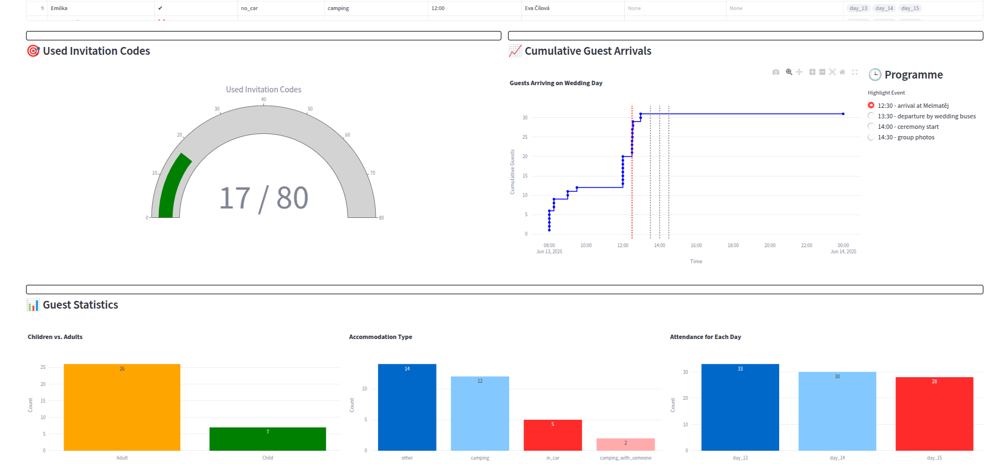

# Dashboard for Wedding Guests' Statistics

Reads from json objects from DynamoDB and produces a dashboard in Streamlit.

<p align="center">
  
  <br/> 
</p>

## Running the App

```
uv venv
uv sync
streamlit run vlada_dashboard/app.py -- "<MongoDbURI>"
```
### Sidequests 

kouknout se na svatebni poradce, kolik to stoji a co vlastne delaji, s cim muzou pomoct (napr ohledne jidla, kolik lednic a kolik lidi potrebuji aby se o to starali, napr raut nefugnguje atp.), organizace co je potreba delat na svatbe, napr po rautu ihned sbalit jidlo a dat ho do lednic, nebo crowd-management cloveka atp.
